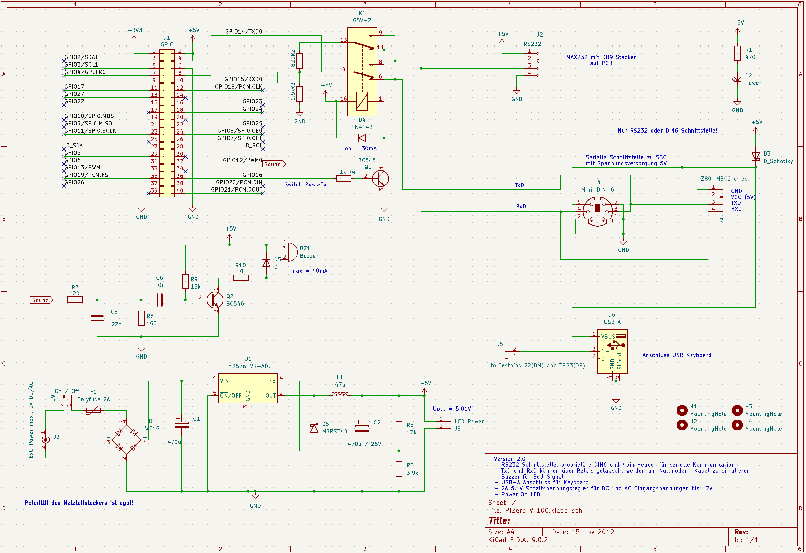

# PiZero VT100 Terminal - Enhanced Edition

A VT100 terminal emulator for Raspberry Pi Zero based on PiGFX by Filippo Bergamasco, enhanced for use with a custom 60% VT100 replica case and adapter board.

## Motivation

Main motivation was that I wanted a terminal emulation for my VT100 replica. Emulation should start within seconds, so a bare metal implementation on a Pi zero seems to be the way to go. I found the PIGFX implementation by Fillippo Bergamasco and used that as a starting point for my modifications. 

Below you see the original VT100 terminal (the color has turned to yellow over the years) and my 60% replica.

   

If you want a 100% VT100 terminal emulation please go for the VT100 simulation from Lars Brinkhoff (https://www.github-zh.com/projects/368074973-terminal-simulator). He simulates the VT100 hardware with original ROMs on a Raspberry Pi. 


## Requirements

My list of requirements was rather short:
- support of VT100 ANSI control sequences, at least of the most important ones
- simulation of a VT100 font and possibly other alternative fonts
- support white on black, amber on black and green on black as terminal font colors
- include simulation of keyclick and bell sound
- configurable via config file at boot and with setup dialog
- design of an adapterboard to provide power (Pi and display), RS232 and custom Mini DIN6 connector for UART host connections
- dynamically switch Rx<>Tx to simulate null modem cable
- 8'' display with at least 800x640 pixel resolution (gives about 80x32 chars with VT100 font)
- provide 5VDC power for connected SBCs, like MBC2-Z80

## What's Different from Original PiGFX

I reduced the original version of PiGFX by Filippo Bergamasco to just support the VT100 features (without sprites, palette and font loading, graphics drawing features) and added support for my additional requirements.


### Hardware Integration

- **Custom Adapter Board**: PCB design for Raspberry Pi Zero integration into VT100 case
- **Modified Back Cover**: 3D printable back plate designed for 60% VT100 replica case
- **Optimized Pin Layout**: Connector placement adapted for compact VT100 housing

### Software Enhancements

- **Improved Configuration System**: Enhanced `pigfx.txt` file parsing with better error handling
- **Setup Dialog**: Interactive configuration menu accessible via Print Screen key
- **Font Registry**: Multiple built-in fonts with dynamic switching capability
- **Enhanced Keyboard Support**: Better PS/2 keyboard compatibility and layout options
- **Audio Features**: PWM-based bell sound and optional key click feedback
- **Debug System**: Improved logging with configurable verbosity levels

### Configuration Features

- **Runtime Configuration**: Live settings changes through setup dialog
- **Extended Options**: Additional UART, keyboard, and display settings
- **Rx-Tx Switching**: dynamic switching of Tx <> Rx to simulate null modem cable
- **Safe Defaults**: Fallback configuration when SD card config unavailable
- **Layout Support**: Multiple keyboard layouts (US, UK, DE, etc.)

The following picture shows the setup dialog:


<div align="center">
  
</div>

## Hardware Components

### Adapter Board

The custom PCB provides:

- 5VDC / 2A switching power supply for Pi and display
- Raspberry Pi Zero mounting and connections
- PS/2 keyboard connector
- RS232 DB9 connector to interface with host
- Compact form factor for VT100 case integration

Below you see the schematic of the adapter board. The KiCad project is located in directory hardware.

<div align="center">
  
</div>

The following picture shows the prototyp of the adapter board still with linear voltage regulator. Final version will hold a switching buck regulator to reduce heat.

<div align="center">
  
</div>


The cable on top of the picture going to the Pi zero connects the D+/D- pins of the USB connector at the back to two testpoints on the Pi. This allows the usage of a standard USB keyboard to be connected to the Pi zero without additional adapter. For more details please see https://maker-tutorials.com/raspberry-pi-zero-mit-usb-buchse-typ-a-erweitern-anloeten/.

As its very hard to find a real RS232 null modem cabe the signal relay (blue) is used to switch the Rx and Tx lines to simulate a null modem cable, if required.
The resistors between Pi zero and relay are used to level shift the RxD signal (only signal that goes into the Pi) to voltage levels below 3.3V. 
The connectors on the back besides the USB-A are a Mini DIN6 connector (for a custom connection to an MBC2-Z80), a RS232 connector module and a 5.5mm power connector.

More information is given in directory hardware.


### Modified Back Cover

The 3D printable back plate features:

- Mounting points for Raspberry Pi Zero adapter board
- Cutouts for power, UART connections and sd card extension cable
- Compatible with 60% VT100 replica cases

This back cover fits into the opening at the back of the VT100 case and has supports to connect the pcb (holes have to be drilled manuall to allow for small adjustments). There is also a support to hold the SD card extension to allow to change the SD card at the back of the case. The other openings fit the connectors on the adapter board and allow mountig of a small ON/OFF switch.

<div align="center">
  
</div>


## Quick Setup

### Hardware Assembly

1. Populate the adapter board starting with the smallest components
2. Check installed submodules (e.g. power supply, )
3. Install Raspberry Pi Zero on adapter board
4. Mount assembly in VT100 case with modified back cover
5. Connect PS/2 keyboard to adapter board
6. Connect power supply

## Assembly of VT100 replica case

The case was printed on a Bamboo Lab P1S printer using the STÖ-files provided by megardi. I discovered that the different parts which have to be glued together did not always fit very well. So be prepared to use a lot of filler and do a lot sanding. It took some time but in the end the result was quite good. I used a special filler for plastics to prepare for the final painting. I discovered that the original color of the VT100 was "oyster white" and by comparing a RAL color table with a picture of the inside of a real VT100 I found that RAL 1013 fits very well.

Here are some pictures of the assembly process:

<div align="center">

   
  

</div>

I used a simple 8'' display from Aliexpress with 1024x768 pixels. The display had no brightness regulation (neither per HDMI nor external). For the future I would recomend to use a controller with brightness control, if possible through software.

In the pictures above I used the resolution 800x640 pixel. With 1024x768 the first 2 characters are civered by the screen bezel. 

To connect the display to the Pi zero I used a flexible adapter cable miniHDMI to miniHDMI (C1-C1). I also installed a SD Card extension cable for easy acces to the sd card slot at the back of the case.

Display:        https://de.aliexpress.com/item/1005004162403387.html?spm=a2g0o.order_list.order_list_main.64.759e5c5fCtHg3D&gatewayAdapt=glo2deu
Cable:          https://de.aliexpress.com/item/1005008622570470.html?spm=a2g0o.order_list.order_list_main.59.7f095c5f7ZEnkL&gatewayAdapt=glo2deu
SD Card Extension:  https://de.aliexpress.com/item/4001200431510.html?spm=a2g0o.order_list.order_list_main.87.759e5c5fCtHg3D&gatewayAdapt=glo2deu


### Software Installation

1. Format SD card as FAT32
2. Copy `bootcode.bin`, `start.elf`, `kernel.img` and `pigfx.txt` to SD card root
3. Insert SD card and power on
4. Connect UART at 115200 baud for terminal access
5. Adjust terminal settings via setup dialog to your needs

### Configuration

- **Interactive Setup**: Press Print Screen key when keyboard connected
- **File Configuration**: Edit `pigfx.txt` on SD card for persistent settings
- **Default Settings**: System works out-of-box with reasonable defaults

## Basic Configuration (`pigfx.txt`)

```ini
# Display Settings
displayWidth = 1024
displayHeight = 768
fontSelection = 2
foregroundColor = 10
backgroundColor = 0

# UART Settings
baudrate = 115200
switchRxTx = 0

# Keyboard Settings
keyboardLayout = us
useUsbKeyboard = 1
keyboardAutorepeat = 1

# Audio Settings
soundLevel = 50
keyClick = 1
```

## Building from Source

```bash
# Build for Raspberry Pi Zero
make RPI=1

# Clean build
make clean
```

## Known Issues

### Display Frame Coverage

- **1024x768 Resolution**: First two characters may be covered by screen bezel
- **Workaround**: Avoid critical text in leftmost positions
- **Future Fix**: Logical screen offset implementation planned

## Hardware Files

- **PCB Design**: Located in `/hardware` directory (KiCad format)
- **3D Models**: OpenSCAD files for back cover modifications in `/OpenScad`
- **Assembly Guide**: See `/doc` for detailed assembly instructions

## Original Project

This project is based on [PiGFX](https://github.com/fbergama/pigfx) by Filippo Bergamasco.
The original project provides the core VT100 terminal emulation and graphics capabilities.

VT100 replica in 60% size was designed by megardi (https://www.instructables.com/23-Scale-VT100-Terminal-Reproduction/).

## License

Copyright (C) 2014-2020 Filippo Bergamasco (Original PiGFX)  
Copyright (C) 2025 Ralf Zühlsdorff (Enhanced Edition)

Licensed under the MIT License - see LICENSE file for details.

## Contributing

Contributions welcome for:

- Hardware design improvements
- Software feature enhancements  
- Documentation updates
- Testing on different Pi models
