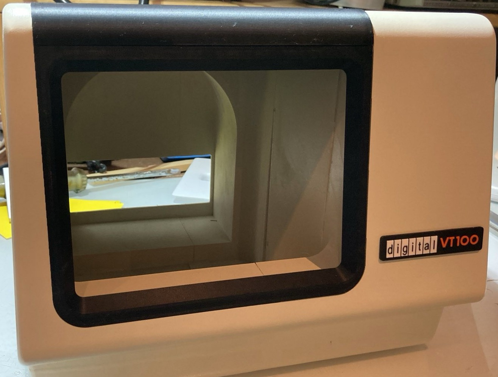

# VT100 Terminal on Bare-Metal Pi (based on PiGFX)

This codebase is derived from PiGFX by Filippo Bergamasco.

Original project:

- PiGFX by Filippo Bergamasco (MIT License)
- Repository: [https://github.com/fbergama/pigfx](https://github.com/fbergama/pigfx)

We keep the original MIT license; see `LICENSE` in this repository for details.

## What’s different in this project

I changed the original code with the intention to create a replica of the DEC VT100 terminal, both in software and hardware. I used a 60% scale 3D model of the VT100 terminal, which was created by Megardi ([Instructables link](https://www.instructables.com/23-Scale-VT100-Terminal-Reproduction/)) for printing the case.

The PiGFX implementation was a very good start for my VT100 software, but to implement my additional requirements I had to add some changes and on the way also fixed some glitches.

I wanted to replicate the real feeling of a VT100 terminal, including fonts and bell. I did not intend to create a 100% emulation of a real VT100. I just wanted a bare‑metal implementation that runs on a Pi Zero, starts up within seconds, and gives me a "retro" feeling when playing with my vintage computer stuff. 

Below you can see the output of my MBC2‑Z80 using CP/M 3.0 with the DEC VT100 font. If you look very closely you can see the simulated scan lines. To me, that is "vintage" enough.

<p align="center">
    
</p>

But if you feel you need a close replication of the original VT100, please refer to the work of Lars Brinkhoff ([GitHub repository](https://github.com/larsbrinkhoff/terminal-simulator)).


## Hardware

The main reason for my additional software requirements was that I created an adapter board for a Pi Zero (any other Pi should also work). The board can be used to power the Pi and an 8" TFT display (I use one that only needs 5 VDC) from a 7.5 to 9 V DC or AC plug‑in power supply. The board also provides a DIN‑6 connector to connect directly to my MBC2‑Z80 board, an RS‑232 port, and a USB Type‑A connector to interface with standard USB keyboards.

I used an RS‑232 adapter (bought from Aliexpress) that not only holds the DB9 connector but also an RS3232 chip. So I only needed to connect the four pins on the back to my board.

The cable you see going from the Pi to the board connects D+/D‑ from the USB‑A connector to test points on the second USB connector on the Pi Zero (see [maker‑tutorials.com guide](https://maker-tutorials.com/raspberry-pi-zero-mit-usb-buchse-typ-a-erweitern-anloeten/)). This was a convenient way to directly connect a USB keyboard to the Pi.

I also added a relay to switch the TxD and RxD lines of the Pi Zero, as I discovered that real null‑modem cables are not easy to find. Finally, I added a simple passive buzzer to the board to simulate the 785 Hz bell tone of the VT100 via software PWM. The following picture shows the prototype of the board (without buzzer).

<p align="center">
  
</p>

The KiCad files are provided in the hardware directory of this repository. For a detailed description, see [Hardware README.md](hardware/README.md).

## List of Modifications

The following modifications and enhancements have been implemented:

- Reorganization of the font build system (see [Font system details](FONT_SYSTEM.md))
- On‑screen setup dialog and file‑based configuration (see [Configuration and Setup](CONFIGURATION.md))
- Rearranging the build system and Makefile
- Implemented Enhancements:
  - Dynamic switching between screen resolutions 640×480, 800×640, and 1024×768
  - Added a “Switch Rx<>Tx” toggle in the setup dialog and applied the setting immediately on save to switch Rx and Tx through a relay
  - Polished auto-repeat handling; repeat delay and rate are configurable in the setup dialog
  - Generate bell sound via software PWM with configurable sound level using a simple passive buzzer

For terminal graphics and palette control sequences, see: doc/GRAPHICS_EXTENSIONS.md

## Quick Start: Graphics over UART

Prereq: Python 3 and pyserial on your host.

Install dependencies (optional helper):

```bash
python3 -m pip install -r tools/requirements.txt
```

Examples using `tools/uart_send.py`:

- Load a 32x32 binary bitmap into slot 0 and blit it at (10,10):

```bash
python3 tools/uart_send.py /dev/ttyUSB0 115200 load-bin 0 32 32 /path/to/bitmap.raw
python3 tools/uart_send.py /dev/ttyUSB0 115200 blit 0 10 10
```

- Upload a simple RGB palette (hex) and select VGA palette:

```bash
python3 tools/uart_send.py /dev/ttyUSB0 115200 palette-upload 16 FF0000,00FF00,0000FF
python3 tools/uart_send.py /dev/ttyUSB0 115200 palette-select 1
```

See `doc/GRAPHICS_EXTENSIONS.md` for the full set of escape sequences and details.

Remark: The setup dialog is entered by pressing the Print Screen key.

## VT100 compatibility (at a glance)

This project aims to feel like a DEC VT100, not to be a byte-perfect emulator. It implements a practical subset of VT100/ANSI plus a few VT220 and private PiGFX extensions.

Supported highlights

- Cursor movement: CUP/HVP (ESC[H / ESC[f] with row;col), and relative moves CUU/CUD/CUF/CUB (ESC[A/B/C/D)
- Clearing: EL/ED variants (ESC[K/J with 0/1/2) including full screen clear to 0,0
- Attributes (SGR): 0, 1, 2, 7, 22, 27; classic colors 30–37/40–47; bright colors 90–97/100–107
- Save/restore position: CSI s/u (ESC[s / ESC[u])
- Cursor visibility: DEC private 25h/25l (VT220), blinking toggle ?25b (PiGFX)
- PiGFX extensions: graphics (ESC[#…]), palette control (ESC[=p), and ANSI.SYS-style mode/font/tab settings (ESC[=…)

Not implemented (highlights)

- VT100: DECSC/DECRC (ESC 7/ESC 8), DECSTBM scrolling region (ESC[`<top>`;`<bottom>`r), tab set/clear (ESC H / ESC[g), CPR (ESC[6n)
- ANSI: CNL/CPL/CHA/VPA/HPR/VPR (line/column absolute/relative), CHT/CBT (tab forward/back), ECH (erase char), ICH/DCH/IL/DL parameter defaults and repeat counts
- SGR attributes: italic (3/23), underline (4/24), blink (5/25), rapid blink (6), conceal/reveal (8/28), crossed-out (9/29), default fg/bg (39/49)

Extended color model

- 8-bit indexed color with built-in palettes (XTerm, VGA, C64, custom)
- 38;5 / 48;5 for 0–255 indexed colors, 38;6 / 48;6 to set and store new defaults (PiGFX extension), 58;5 for transparent color

Full matrix and exact sequences: see Terminal codes and compatibility in doc/terminal_codes.md.

› File: doc/terminal_codes.md

## Still to do

The following modifications are on the list of open to‑dos:

- [x] Remove the sprite implementation from the code
- [ ] Remove feature to upload fonts
- [ ] Analyze code to remove dead code
- [ ] Rearrange the include and file hierarchy for a more structured architecture
- [ ] Add OpenSCAD file for back plate of terminal to hold the adapter board at the back and allow access to the connectors, power switch and sd card

## Building the Application

The font build system is described in the link above. The main Makefile has been modified to use a variable to control the build for different targets and also rebuilds the USB library:

**Single RPI Variable Control:**

- Use `make RPI=1` for Raspberry Pi 1
- Use `make RPI=2` for Raspberry Pi 2
- Use `make RPI=3` for Raspberry Pi 3
- Use `make RPI=4` for Raspberry Pi 4

**Automatic Toolchain Selection:**

- Pi 1-3: Automatically uses `arm-none-eabi-` toolchain
- Pi 4: Automatically uses `aarch64-linux-gnu-` toolchain
- No manual toolchain configuration required

**Intelligent USB Library Management:**

- Automatically builds uspi library for Pi 1-3
- Skips uspi for Pi 4 (not required)
- Automatic Config.mk regeneration when switching Pi versions
- Proper cross-compilation with correct architectures

**Build Information Display:**

```text
Creating kernel.img for Raspberry Pi 1
==========================================
Build completed for Raspberry Pi 1
Target: kernel
Toolchain: arm-none-eabi-
USPI: Included for Pi 1
==========================================
```


## Remarks on building the VT100 Case

The VT100 case was printed on a Bamboo Lab P1S 3D printer using the STL files provided by Megardi. Printing took some time (about 15 hours in total). When I tried to glue the pieces together I discovered that the printed parts of the 3D model, at least in my experience, do not always fit very well together. It took a lot of filling and sanding to get the case in shape.

I then applied a light‑grey filler to smooth the surface and prepare the case for painting. I painted the case in color RAL1015 "Oyster White" which, in my opinion, comes very close to the original color.





## Installing

To install the adapter board with the Pi Zero, a specific back plate has been designed which fits the layout of the connectors on the board.
The OpenSCAD file for the modified back plate can be found in the hardware directory.

In addition, an SD card extender cable is used to provide access to the SD card at the back of the terminal through a small slot. The connection to the TFT controller is done using a very flexible mini HDMI to mini HDMI cable. The display controller is affixed to the back of the display with double‑sided tape, but be aware to only use very small strips on both sides of the controller board. The tape is very, very sticky and I damaged the connection between controller and display trying to remove the controller from the back of the display!


Parts used:

- SD Card extension cable: [AliExpress link](https://de.aliexpress.com/item/4001200431510.html?spm=a2g0o.order_list.order_list_main.11.51de5c5fxcDiwo&gatewayAdapt=glo2deu)
- mini HDMI to mini HDMI cable: [AliExpress link](https://de.aliexpress.com/item/1005008622570470.html?spm=a2g0o.order_list.order_list_main.41.51de5c5fxcDiwo&gatewayAdapt=glo2d)
    Remark: Use the C1 - C1 option!
- 8'' Display and controller: [AliExpress link](https://de.aliexpress.com/item/1005004162403387.html?spm=a2g0o.order_list.order_list_main.47.51de5c5fxcDiwo&gatewayAdapt=glo2deu)
- passive 5 VDC buzzer: [AliExpress link](https://de.aliexpress.com/item/1005008785167242.html?spm=a2g0o.order_list.order_list_main.15.37205c5f1Nn217&gatewayAdapt=glo2deu)
- RS232 adapter: [AliExpress link](https://de.aliexpress.com/item/1005008264187706.html?spm=a2g0o.order_list.order_list_main.137.37205c5f1Nn217&gatewayAdapt=glo2deu)

## Upstream compatibility

This project does not intend to be upstream compatible with the original PiGFX project!
I will add new features and reduce the code to the minimum to implement my requirements.

## License

MIT License © Original authors and contributors.
See `LICENSE` for details.
