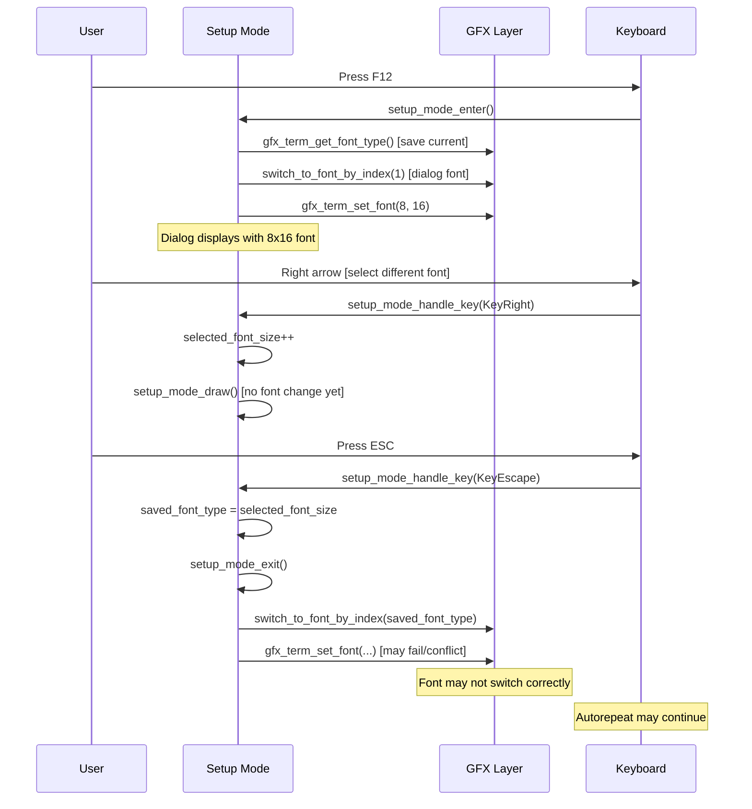
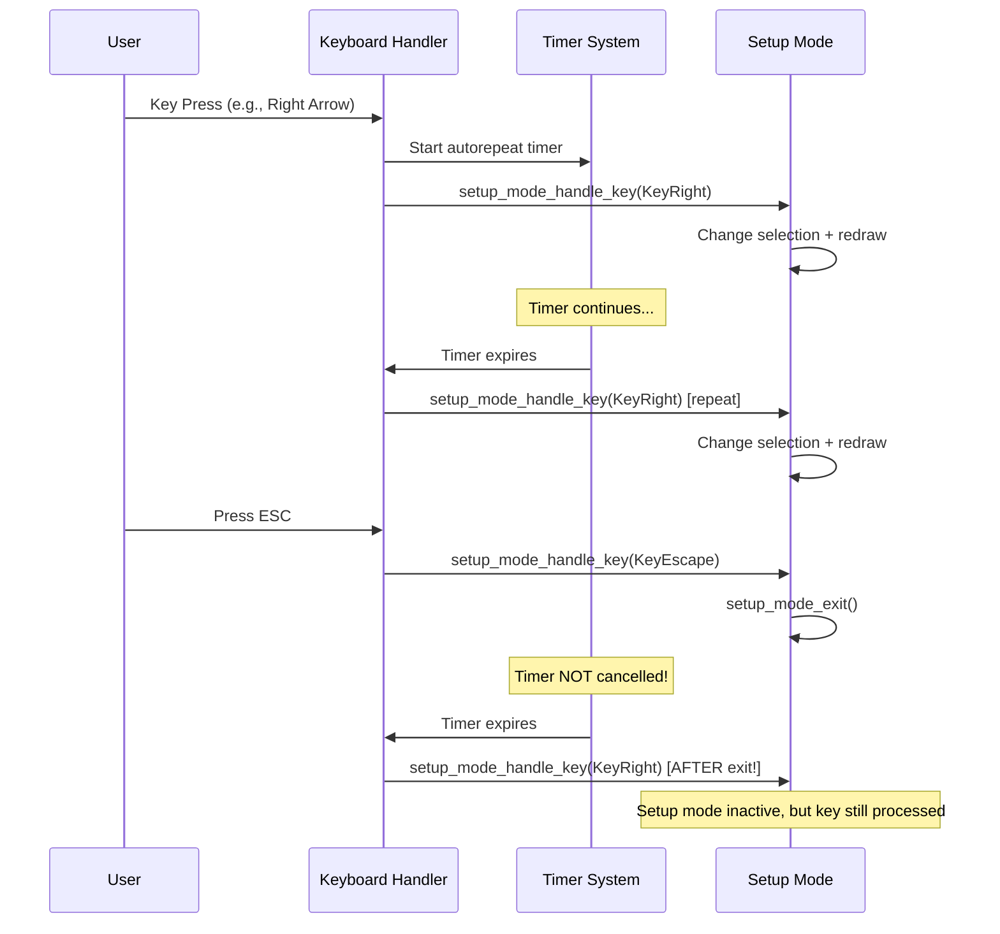

# PiGFX Font Handling Architecture Analysis

## Overview
This document analyzes the font handling system in PiGFX, focusing on the setup mode font selection functionality. The analysis reveals several architectural issues that cause font switching problems, display freezes, and keyboard autorepeat issues.

## Current Architecture

### Font System Components

1. **Font Storage Layer** (`binary_assets.s`)
   - Binary font data embedded in kernel
   - Font symbols: `G_FONT8X8_GLYPHS`, `G_FONT8X16_GLYPHS`, `G_FONT8X24_GLYPHS`
   - Spleen fonts: `G_SPLEEN6X12_GLYPHS`, `G_SPLEEN8X16_GLYPHS`, etc.

2. **Font Management Layer** (`gfx.c`)
   - `gfx_term_set_font(width, height)` - Main font switching function
   - `gfx_term_get_font_type()` - Font identification function
   - Font glyph address functions for each font type

3. **Setup Interface Layer** (`setup.c`)
   - Font selection menu with 8 font options
   - `switch_to_font_by_index(index)` - Setup-specific font switching
   - Font state management during setup mode

### Font Data Flow

```
Font Files (fonts/*.bin) 
    ↓
Binary Assets (binary_assets.s)
    ↓
Font Symbols (G_*_GLYPHS)
    ↓
Font Management (gfx.c)
    ↓
Setup Interface (setup.c)
    ↓
User Selection
```

## Current Implementation Problems

### Problem 1: Inconsistent Font Mapping
The setup font index doesn't directly correspond to the font type returned by `gfx_term_get_font_type()`:

**Setup Array (setup.c)**:
```
Index 0: "8x8"           → gfx_term_set_font(8, 8)
Index 1: "8x16"          → gfx_term_set_font(8, 16)
Index 2: "8x24"          → gfx_term_set_font(8, 24)
Index 3: "6x12 Spleen"   → gfx_term_set_font(6, 12)
Index 4: "12x24 Spleen"  → gfx_term_set_font(12, 24)
Index 5: "16x32 Spleen"  → gfx_term_set_font(16, 32)
Index 6: "32x64 Spleen"  → gfx_term_set_font(32, 64)
Index 7: "8x16 Spleen"   → gfx_term_set_font(-8, 16)
```

**Font Type Detection (gfx.c)**:
```
Type 0: G_FONT8X8_GLYPHS      → 8x8
Type 1: G_FONT8X16_GLYPHS     → 8x16 original
Type 2: G_FONT8X24_GLYPHS     → 8x24 original
Type 3: G_SPLEEN6X12_GLYPHS   → 6x12 Spleen
Type 4: G_SPLEEN12X24_GLYPHS  → 12x24 Spleen
Type 5: G_SPLEEN16X32_GLYPHS  → 16x32 Spleen
Type 6: G_SPLEEN32X64_GLYPHS  → 32x64 Spleen
Type 7: G_SPLEEN8X16_GLYPHS   → 8x16 Spleen
```

### Problem 2: Font Switching Logic Issues
The `gfx_term_set_font()` function in `gfx.c` uses width/height matching:

```c
void gfx_term_set_font(int width, int height)
{
    if (width == 8)
    {
        switch (height)
        {
        case 8:  // Works - unique combination
        case 16: // CONFLICT: Could be original OR Spleen 8x16
        case 24: // May work if font exists
        }
    }
    // ... other width cases
    else if (width == -8) // Special case for Spleen 8x16
    {
        // Uses G_SPLEEN8X16_GLYPHS
    }
}
```

**Issue**: When `gfx_term_set_font(8, 16)` is called, it always selects the original 8x16 font, never the Spleen 8x16.

### Problem 3: Setup Mode Font State Management
The setup mode has complex font state handling that causes conflicts:

## Sequence Diagrams

### Font Selection Sequence (Current - Problematic)



### Keyboard Autorepeat Issue



## Root Cause Analysis

### Issue 1: Ambiguous Font Identification
- Multiple fonts can have same width/height (8x16 original vs Spleen)
- Font switching relies on dimensions, not unique identifiers
- Special case handling (-8 width) is fragile

### Issue 2: State Management Complexity
- Setup mode saves/restores font state
- Font switching happens at exit, after restoration
- Conflicts between saved state and new selection

### Issue 3: Keyboard Autorepeat Integration
- Setup mode doesn't properly handle autorepeat timers
- Key events continue after setup mode exits
- No mechanism to cancel pending autorepeat

### Issue 4: Missing Font Existence Checks
- `gfx_term_set_font()` may silently fail if font doesn't exist
- No fallback mechanism for failed font switches
- Some fonts may not be properly linked or loaded

## Proposed Architecture Improvements

### New Approach: Generic Font Management System

The current font system is fundamentally broken. Instead of fixing the existing approach, we need a complete redesign based on a generic font management system using the PiGFX binary format.

### Requirements for Generic Font System

1. **Font Metadata Structure**
   - Font name (human-readable identifier)
   - Width in pixels
   - Height in pixels  
   - Binary data pointer
   - Glyph address function pointer

2. **Universal Character Support**
   - All ANSI characters (0x20-0x7F)
   - Extended graphics characters
   - Consistent glyph mapping across all fonts

3. **Font Registry System**
   - Dynamic font registration
   - Font enumeration by index
   - Font lookup by name or dimensions
   - Validation of font completeness

4. **Simplified Font API**
   - `font_register()` - Register a new font
   - `font_set_by_index()` - Switch to font by registry index  
   - `font_set_by_name()` - Switch to font by name
   - `font_get_count()` - Get total number of available fonts
   - `font_get_info()` - Get font metadata by index

### Font Data Structure Design

```c
typedef struct {
    const char* name;              // Human-readable name (e.g., "Spleen 16x32")
    int width;                     // Character width in pixels
    int height;                    // Character height in pixels
    const unsigned char* data;     // Pointer to binary font data
    unsigned char* (*get_glyph)(unsigned int c);  // Glyph address function
    int is_valid;                  // Font validation flag
} font_descriptor_t;

typedef struct {
    font_descriptor_t fonts[MAX_FONTS];
    int count;                     // Number of registered fonts
    int current_index;             // Currently active font index
} font_registry_t;
```

### Implementation Strategy

1. **Phase 1: Font Registry Implementation**
   - Create font descriptor structure
   - Implement font registry with registration functions
   - Add font validation (verify all required characters exist)

2. **Phase 2: Font Registration**
   - Register all existing fonts (original + Spleen) in the registry
   - Create standardized glyph address functions
   - Implement font enumeration and lookup

3. **Phase 3: Setup Integration**
   - Replace current font arrays with registry-based selection
   - Use font indices from registry instead of hardcoded mappings
   - Simplify font switching logic

4. **Phase 4: Validation and Testing**
   - Add font completeness validation
   - Test all registered fonts for proper character rendering
   - Add error handling for invalid fonts

### Benefits of New Approach

- **Eliminates hardcoded font mappings** - No more dimension conflicts
- **Supports any number of fonts** - Easy to add new fonts
- **Automatic validation** - Detect broken or incomplete fonts
- **Consistent API** - Uniform font handling throughout codebase
- **Better error handling** - Graceful fallback for invalid fonts
- **Future-proof** - Easy to extend with new font formats

## Implementation Priority

1. **High Priority**: Implement generic font registry system
2. **High Priority**: Register all existing fonts with validation
3. **High Priority**: Fix autorepeat timer cancellation  
4. **Medium Priority**: Update setup mode to use font registry
5. **Low Priority**: Add advanced font features and error reporting

## Next Steps

1. Create `font_registry.h` and `font_registry.c` with the new font management system
2. Register all existing fonts in the new registry during initialization
3. Update `setup.c` to use registry-based font selection
4. Remove old hardcoded font switching logic
5. Test all fonts for proper character rendering

This new approach eliminates the fundamental architectural flaws by treating fonts as registered resources rather than hardcoded cases.
